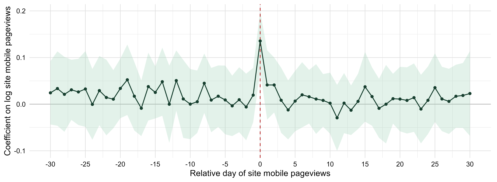
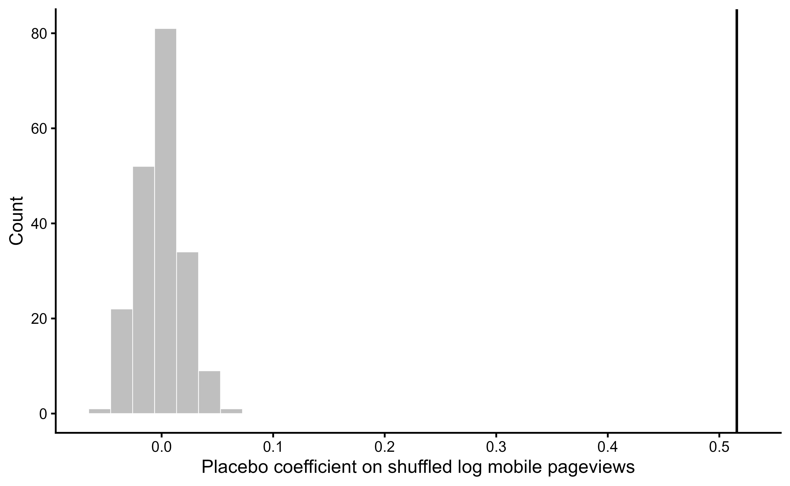
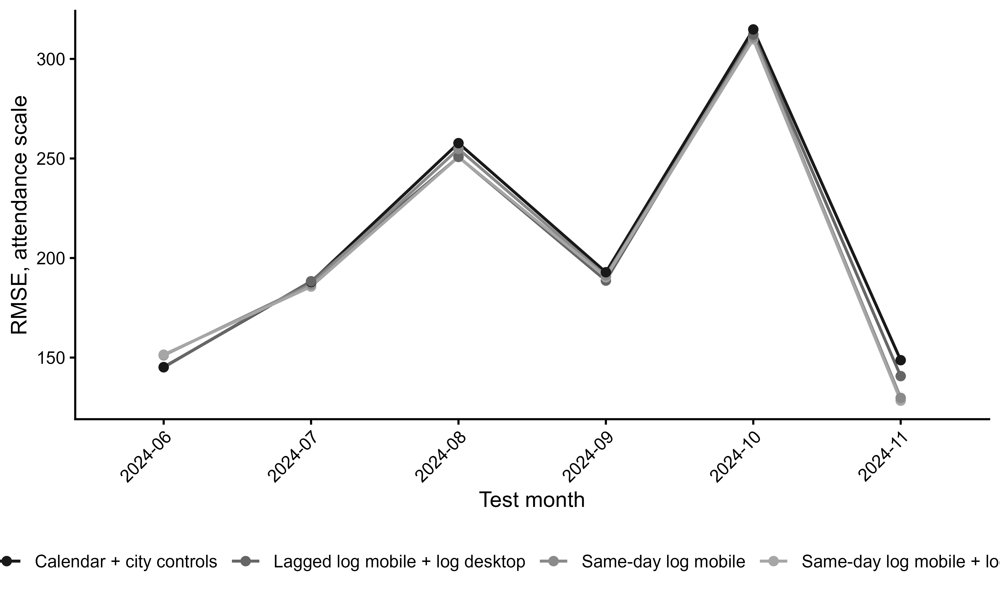

```{r setup, include=FALSE}
knitr::opts_chunk$set(
  echo = FALSE,
  message = FALSE,
  warning = FALSE,
  fig.align = "center",
  fig.width = 9,
  fig.height = 4
)

library(jsonlite)
library(knitr)

results_path <- file.path("outputs", "results", "loglog_analysis_results.json")
if (!file.exists(results_path)) {
  stop("Missing outputs/results/loglog_analysis_results.json. Run Rscript analysis/compile_clean_report.R first.", call. = FALSE)
}

results <- jsonlite::fromJSON(results_path, simplifyDataFrame = TRUE)

fmt2 <- function(x) formatC(as.numeric(x), format = "f", digits = 2, big.mark = ",")
fmt3 <- function(x) formatC(as.numeric(x), format = "f", digits = 3)
fmt4 <- function(x) formatC(as.numeric(x), format = "f", digits = 4)

clean_table <- function(x) {
  as.data.frame(x, stringsAsFactors = FALSE, check.names = FALSE)
}
```

# Sample

The panel contains `r format(results$sample$observations, big.mark = ",")` site-day observations,
`r results$sample$places` venues, and `r format(results$sample$dates, big.mark = ",")` dates from
`r results$sample$start` to `r results$sample$end`.

```{r sample-table}
sample_table <- data.frame(
  Statistic = c(
    "Observations",
    "Venues",
    "Dates",
    "Zero-attendance share",
    "Mean attendance",
    "Mean mobile pageviews",
    "Median mobile pageviews"
  ),
  Value = c(
    format(results$sample$observations, big.mark = ","),
    results$sample$places,
    format(results$sample$dates, big.mark = ","),
    paste0(fmt2(100 * results$sample$zero_share), "%"),
    fmt2(results$sample$mean_attendance),
    fmt2(results$sample$mean_mobile),
    fmt2(results$sample$median_mobile)
  )
)
kable(sample_table, align = c("l", "r"))
```

# Preferred DK Timing Estimate

The preferred specification is the log-log TWFE lead-lag model with lagged attendance,
venue fixed effects, exact-date fixed effects, venue-by-year-month fixed effects, and
venue-by-day-of-week fixed effects. Inference uses Driscoll-Kraay standard errors with
a 30-day bandwidth and Bonferroni simultaneous 95 percent confidence intervals across
the 61 lead-lag coefficients.

```{r preferred-table}
preferred_table <- clean_table(results$preferred_timing_table)
kable(
  preferred_table,
  col.names = c("Model", "Day-0 log mobile", "Simultaneous 95% CI", "R2", "Within R2", "N"),
  align = c("l", rep("r", 5))
)
```

The preferred coefficient is `r preferred_table$same_day_log_mobile[1]`. Interpreted in
the log(1+x) metric, a 1 percent increase in same-day mobile Wikipedia pageviews is
associated with about a `r fmt3(100 * results$lead_lag$day_0)` percent increase in
attendance, conditional on the full timing profile and fixed effects.

# Local Lead-Lag Window

```{r local-lead-lag-table}
local_table <- clean_table(results$lead_lag$local)
kable(
  local_table,
  col.names = c("Relative day", "Estimate", "DK SE", "Simult. CI low", "Simult. CI high"),
  align = rep("r", 5)
)
```

```{r lead-lag-figure, results='asis'}
lead_lag_fig <- file.path("outputs", "figures", "loglog_lead_lag_autocorr_wide_no_title.png")
if (file.exists(lead_lag_fig)) {
  cat('')
}
```

# Serial-Correlation Diagnostics

```{r autocorr-table}
autocorr_table <- clean_table(results$autocorr_table)
diagnostic_table <- autocorr_table[autocorr_table$model != "Same-day log mobile", ]
kable(
  diagnostic_table,
  col.names = c("Diagnostic model", "Day-0 coefficient", "Interpretation", "R2", "Within R2", "N"),
  align = c("l", "r", "l", "r", "r", "r")
)
```

These diagnostics explain why the conservative lead-lag coefficient is smaller than
the simple same-day association. Once serial correlation and site-specific seasonality
are handled, the defensible estimate is the day-0 coefficient from the preferred model.

# Placebo Checks

```{r placebo-table}
placebo_table <- clean_table(results$placebo_table)
kable(placebo_table, col.names = c("Placebo diagnostic", "Value"), align = c("l", "r"))
```

```{r placebo-figure, results='asis'}
placebo_fig <- file.path("outputs", "figures", "loglog_placebo_no_title.png")
if (file.exists(placebo_fig)) {
  cat('')
}
```

# Nowcasting

The nowcasting exercise evaluates prediction on the attendance scale. RMSE is useful
when large misses matter operationally, but it is complemented with MAE, log-RMSE, and
correlations because closures and exceptional events can generate large errors that no
baseline model can predict.

```{r holdout-table}
holdout_table <- clean_table(results$holdout$scores)
holdout_table$rmse_entries <- fmt2(holdout_table$rmse_entries)
holdout_table$mae_entries <- fmt2(holdout_table$mae_entries)
holdout_table$rmse_log <- fmt3(holdout_table$rmse_log)
holdout_table$correlation_entries <- fmt3(holdout_table$correlation_entries)
kable(
  holdout_table[, c("model", "rmse_entries", "mae_entries", "rmse_log", "correlation_entries", "n", "test_start")],
  col.names = c("Model", "RMSE", "MAE", "Log RMSE", "Correlation", "N", "Test start"),
  align = c("l", rep("r", 6))
)
```

```{r rolling-table}
rolling_table <- clean_table(results$rolling$summary)
rolling_table$mean_rmse_entries <- fmt2(rolling_table$mean_rmse_entries)
rolling_table$mean_mae_entries <- fmt2(rolling_table$mean_mae_entries)
rolling_table$mean_rmse_log <- fmt3(rolling_table$mean_rmse_log)
rolling_table$mean_correlation_entries <- fmt3(rolling_table$mean_correlation_entries)
kable(
  rolling_table,
  col.names = c("Model", "Mean RMSE", "Mean MAE", "Mean log RMSE", "Mean correlation"),
  align = c("l", rep("r", 4))
)
```

```{r rolling-figure, results='asis'}
rolling_fig <- file.path("outputs", "figures", "loglog_rolling_rmse_no_title.png")
if (file.exists(rolling_fig)) {
  cat('')
}
```

# Interpretation

The clean interpretation is narrow: same-day mobile Wikipedia attention is a real-time
signal of public interest in a venue. It should not be presented as a causal effect of
Wikipedia browsing on attendance and it should not be treated as a visitor counter. Its
main value is as a contemporaneous nowcasting signal, especially when attendance departs
from predictable calendar patterns.
